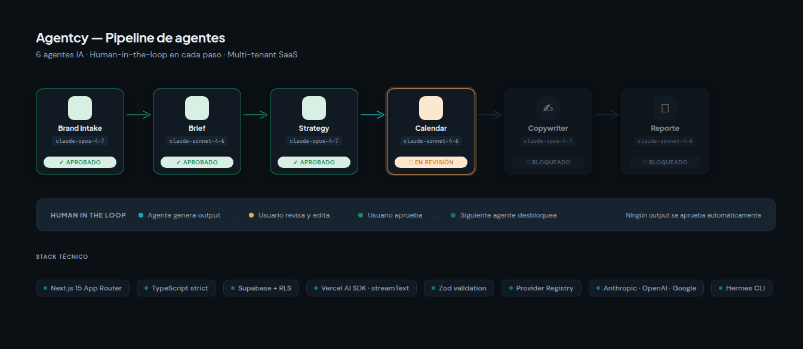
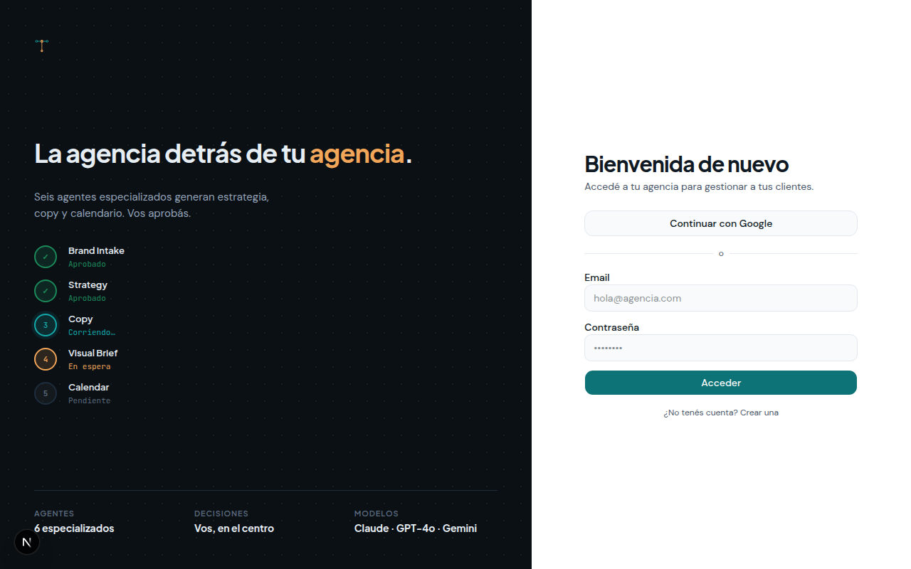
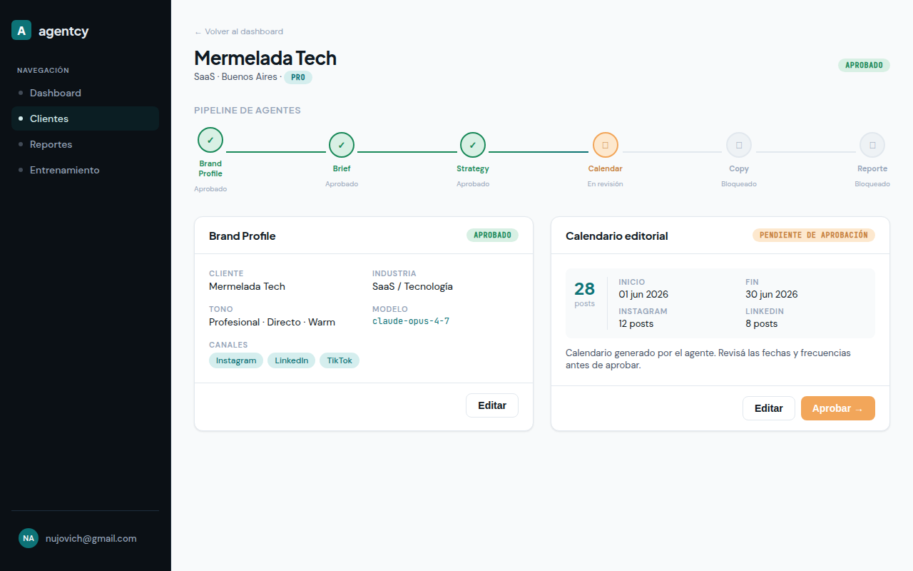
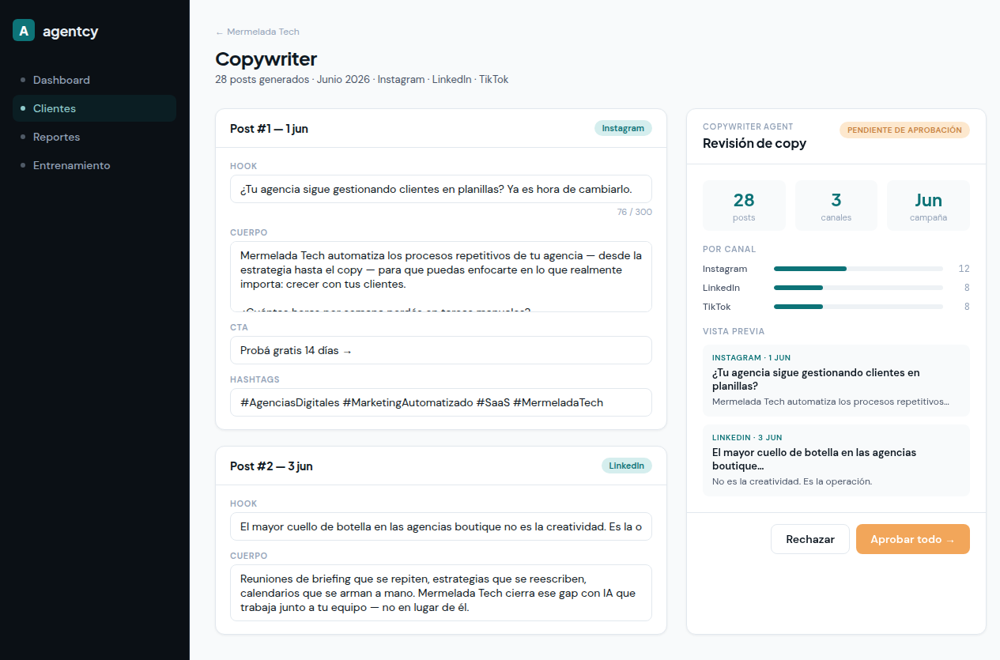

# Agentcy

> *La agencia detrás de tu agencia.*

Control-room SaaS for boutique marketing agencies. A 6-agent AI pipeline turns a brand brief into a full month of approved, ready-to-publish content — with humans approving every step.



---

## What it does

Agentcy orchestrates six specialized AI agents in a strict sequential pipeline. Each agent produces output that the agency team reviews, edits, and approves before the next one runs. Nothing is auto-approved.

| Step | Agent | Output |
|------|-------|--------|
| 1 | **Brand Intake** | Brand Profile — voice, audience, pillars, visual kit |
| 2 | **Brief** | Campaign brief with objectives and KPIs |
| 3 | **Strategy** | Full content strategy with channel mix |
| 4 | **Calendar** | Editorial calendar with post schedule by channel |
| 5 | **Copywriter** | Post-by-post copy: hook, body, CTA, hashtags, video script |
| 6 | **Reporte** | Campaign performance report |

---

## Screenshots

### Login


### Client pipeline — tracking all 6 agent steps


### Copywriter — editor + approval panel side-by-side


---

## Architecture

```
src/
├── agents/
│   ├── provider-registry.ts      # Single LLM abstraction (Anthropic / OpenAI / Google)
│   ├── brand-intake.agent.ts
│   ├── brief.agent.ts
│   ├── calendar.agent.ts
│   ├── copywriter.agent.ts
│   ├── strategy.agent.ts
│   ├── report.agent.ts
│   └── prompts/                  # System prompts as TS modules
├── app/
│   ├── (auth)/login/             # Two-column login, dark left panel
│   ├── (dashboard)/
│   │   ├── clients/[id]/         # Client detail + pipeline tracker
│   │   ├── clients/[id]/strategy/
│   │   ├── clients/[id]/calendar/
│   │   ├── clients/[id]/copywriter/
│   │   └── training/             # Fine-tuning dashboard
│   └── api/
│       ├── agents/               # Streaming agent endpoints
│       ├── strategies/
│       ├── editorial-calendars/
│       ├── copywriting-projects/
│       ├── trajectories/         # Data flywheel
│       ├── datasets/
│       └── train/
├── components/
│   ├── agents/approval-panel.tsx # Shared approval UI (all 6 steps)
│   ├── brand-intake/
│   ├── calendar/
│   ├── copywriter/
│   ├── strategy/
│   └── training/
└── types/                        # Zod-validated shared types
```

### Key design decisions

**Provider Registry** — `src/agents/provider-registry.ts` is the only file that imports from `@ai-sdk/anthropic`, `@ai-sdk/openai`, or `@ai-sdk/google`. Every agent receives an `AgentProvider` instance and never knows which LLM is behind it. This makes model-swapping a one-line config change.

**Human-in-the-loop** — No agent output is ever persisted with `status: 'approved'` automatically. The pipeline gate is strict: agent generates → user reviews/edits → user approves → next step unlocks.

**Streaming** — All agents stream via Vercel AI SDK (`streamText` on the API route, `useCompletion` on the client). Users see output appear token-by-token.

**Multi-tenancy** — Every Supabase query filters by `agency_id` explicitly. RLS is enabled on all tables as a second line of defense, but it's never the only guard.

**Data flywheel** — Every agent interaction is captured as a trajectory (input, output, segments, tokens). Users rate outputs; approved edits become training signal. The training dashboard generates fine-tuning datasets from high-quality trajectories.

---

## Tech stack

| Concern | Choice |
|---------|--------|
| Framework | Next.js 15 (App Router) |
| Language | TypeScript strict |
| Database | Supabase (Postgres + RLS + Auth) |
| AI SDK | Vercel AI SDK — `streamText` / `generateText` |
| LLMs | Anthropic Claude (primary), OpenAI, Google |
| Validation | Zod |
| Styling | Tailwind CSS v4 + shadcn/ui |
| Fonts | Plus Jakarta Sans · DM Sans · JetBrains Mono |
| CLI agent | Hermes (`HERMES_CLI_PATH`) |

---

## Getting started

### Prerequisites

- Node.js >= 20.9.0
- A Supabase project
- At least one LLM API key (Anthropic recommended)

### Environment variables

```bash
cp .env.local.example .env.local
```

```env
NEXT_PUBLIC_SUPABASE_URL=your-supabase-url
NEXT_PUBLIC_SUPABASE_ANON_KEY=your-anon-key
SUPABASE_SERVICE_ROLE_KEY=your-service-role-key

ANTHROPIC_API_KEY=your-key
OPENAI_API_KEY=your-key          # optional
GOOGLE_GENERATIVE_AI_API_KEY=    # optional

HERMES_CLI_PATH=/path/to/hermes  # optional, for CLI agent
```

### Run locally

```bash
npm install
npm run dev
```

Open [http://localhost:3000](http://localhost:3000).

### Database

```bash
npx supabase db push
```

---

## Rules for contributors

Architecture rules, coding conventions, and the human-in-the-loop contract are in [CLAUDE.md](CLAUDE.md). Read it before writing any code — it applies to humans and AI agents alike.

Design tokens, component rules, and copy style are in [DESIGN.md](DESIGN.md).

If you're using an AI coding assistant (Claude Code, Hermes, or other), see [AGENTS.md](AGENTS.md) — it mandates reading CLAUDE.md before starting any session.
